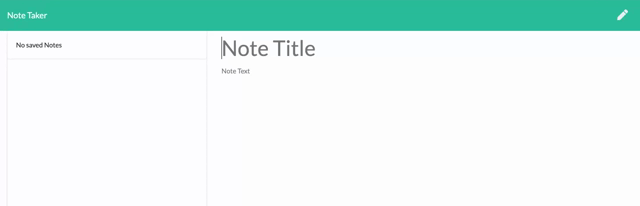

# Express Notes App

## Description

An organizational tool that allows users to draft, save, and delete notes in order to manage tasks and other concerns. 

This application runs with an express backend that saves and retieves data from a JSON file. 

## Demo



## Table of Contents

1. Installation
2. Usage
3. License
4. Contributions

## Installation

Run the following command in terminal to install all application dependencies:

```
npm install
```

## Usage

To access the application locally run the following commands in the terminal:

```
npm start
```

The application is also deployed on heroku:

## License


## Contributing

[Stefanie Serpa](https://github.com/smserpa)


